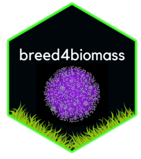

# breed4biomass 


<!-- badges: start -->
<!-- badges: end -->

The goal of breed4biomass is to ...

## Installation

You can install the development version of breed4biomass from [GitHub](https://github.com/) with:

``` r
# install.packages("devtools")
devtools::install_github("elesandrobornhofen/breed4biomass")
```

## Example

This is a basic example which shows you how to solve a common problem:

``` r
library(breed4biomass)
## basic example code
```

